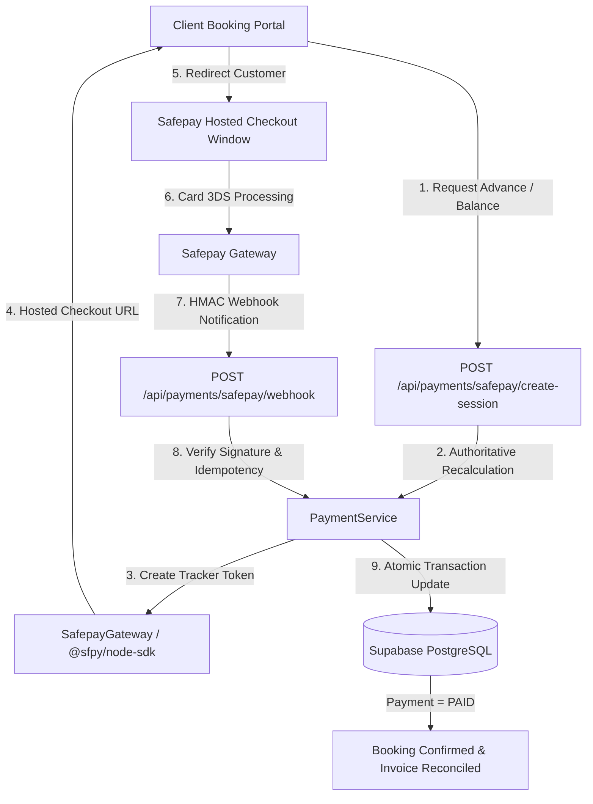

# 💳 Safepay Sandbox & Production Payments Integration

This document outlines the official payment architecture, gateway configuration, environment variables, transaction lifecycles, and security protocols for **AR Events Co.**

---

## 1. Gateway Overview
- **Payment Provider**: [Safepay](https://getsafepay.com/) (Official Node.js SDK `@sfpy/node-sdk`)
- **Supported Payment Methods**:
  - Visa / MasterCard Debit & Credit Cards
  - UnionPay & PayPak Cards
  - 256-Bit SSL 3D-Secure 2.0 Authenticated Checkout
- **Currency**: Pakistani Rupee (`PKR`)
- **Monetary Unit Representation**: All monetary values are handled and stored in integer Paisa (1 PKR = 100 Paisa) to prevent floating-point precision errors.

---

## 2. Environment Variables

Add the following environment variables to your deployment environment (e.g. Vercel Project Settings) and `.env`:

```env
# ------------------------------------------------------------------------------
# SAFEPAY ONLINE PAYMENTS (SANDBOX / PRODUCTION)
# ------------------------------------------------------------------------------
SAFEPAY_ENVIRONMENT="sandbox" # Set to "production" when launching live
SAFEPAY_API_KEY="sec_8f267889-2ac1-401b-99b1-e5f002f695af"
SAFEPAY_SECRET_KEY="26f25765f46eaa6e4cee363b8966988637cbdf05958766feef038507eabecb17"
SAFEPAY_WEBHOOK_SECRET="26f25765f46eaa6e4cee363b8966988637cbdf05958766feef038507eabecb17"

# Public App URL for Checkout Redirects
NEXT_PUBLIC_APP_URL="https://areventsco.com"
```

> [!WARNING]
> Never commit real production secrets to Git. Keep `SAFEPAY_SECRET_KEY` and `SAFEPAY_WEBHOOK_SECRET` strictly on the server-side.

---

## 3. Architecture & Separation of Concerns



### Key Modules:
- **`src/lib/payments/safepay.ts`**: Pure provider wrapper for `@sfpy/node-sdk`, tracker creation, hosted URL builder, and HMAC-SHA256 signature verification.
- **`src/lib/payments/payment-service.ts`**: High-level payment orchestration handling amount calculation, database transactions, idempotency checks, booking state transitions, and invoice audit logging.
- **`src/app/api/payments/safepay/create-session/route.ts`**: Checkout session initiator.
- **`src/app/api/payments/safepay/webhook/route.ts`**: Webhook event receiver.
- **`src/app/api/payments/safepay/verify/route.ts`**: Active gateway verification endpoint.

---

## 4. End-to-End Payment Lifecycle

1. **Booking Initiated**: Customer creates a booking for a birthday package/theme.
2. **Authoritative Server Pricing**: The system calculates the total amount (e.g., PKR 114,000) and the required 30% advance deposit (PKR 34,200).
3. **Session Initialized**: Customer clicks **"Pay Advance Deposit (PKR 34,200)"** on `/booking/[reference]`.
   - `PaymentService` creates a `Payment` record in state `PENDING` with tracker token `track_xxx`.
   - Returns hosted checkout URL: `https://sandbox.api.getsafepay.com/checkout/pay?beacon=track_xxx...`
4. **Checkout Execution**: Customer completes 3D-secure card authentication on Safepay.
5. **Webhook Confirmation**:
   - Safepay posts webhook event (`payment.completed`) to `/api/payments/safepay/webhook` with `x-sfpy-signature`.
   - Server validates HMAC-SHA256 signature.
   - Atomically updates:
     - `Payment.status = "PAID"`
     - `Booking.amountPaidMinor += payment.amountMinor`
     - `Booking.status = "CONFIRMED"`
     - `Invoice.amountPaidMinor += payment.amountMinor`
     - `Invoice.status = "PARTIALLY_PAID" | "PAID"`
     - `InvoiceAuditLog` created with action `PAYMENT_RECORDED`.
6. **Customer Return**:
   - Redirects customer back to `/booking/[reference]?payment=success&token=track_xxx`.
   - Frontend verifies confirmation and renders the official verified digital receipt with **"Download Official Invoice (PDF)"** action.

---

## 5. Security & Idempotency Rules

- **Zero Trust on Frontend Amounts**: The payment amount is **always** recalculated server-side directly from the database booking record. No frontend payload or URL parameter can alter the payable amount.
- **Idempotent Webhooks**: If Safepay sends duplicate webhook notifications for the same transaction, the handler verifies whether `Payment.status` is already `PAID` and returns HTTP 200 without executing duplicate database adjustments.
- **HMAC Signature Verification**: All webhook requests must pass constant-time HMAC-SHA256 signature checks against `SAFEPAY_WEBHOOK_SECRET`.
- **PCI-DSS Compliance**: Sensitive card numbers and CVVs are entered directly in Safepay's hosted PCI-DSS Level 1 environment. The AR Events Co. platform never receives or stores raw card data.

---

## 6. Admin Panel Management

Administrators have access to real-time payment reconciliation at `/admin/payments`:
- **Financial Metrics**: Total Collected, Safepay Volume, Today's Revenue, This Month's Revenue.
- **Transaction Table**: Filterable by Gateway (`Safepay`, `Bank Transfer`), Status (`PAID`, `PENDING`, `FAILED`), and search query.
- **Dedicated Payment Workspace (`/admin/payments/[id]`)**:
  - Full transaction overview.
  - Linked Booking & Customer details.
  - Linked Invoice breakdown.
  - Read-only Safepay Gateway live tracker payload inspection.
  - **"Verify with Gateway"** button to force live synchronization with Safepay servers.

---

## 7. Transitioning from Sandbox to Production

When Safepay approves production merchant onboarding and KYC:
1. Set `SAFEPAY_ENVIRONMENT="production"` in Vercel.
2. Update `SAFEPAY_API_KEY`, `SAFEPAY_SECRET_KEY`, and `SAFEPAY_WEBHOOK_SECRET` with live production credentials.
3. Configure the Production Webhook URL in your Safepay Merchant Dashboard:
   `https://areventsco.com/api/payments/safepay/webhook`
4. Set `NEXT_PUBLIC_APP_URL="https://areventsco.com"`.
