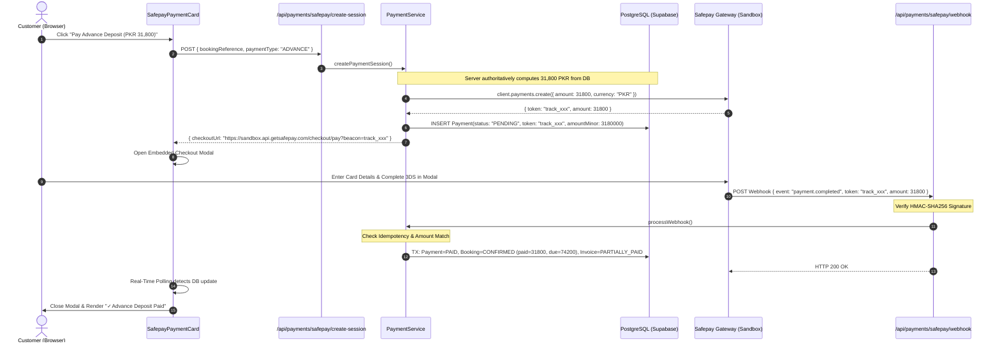

# 💳 Production Safepay Payments Integration & Architecture — AR Events Co.

This document outlines the official payment architecture, monetary unit conversion invariants, gateway configuration, environment variables, transaction lifecycles, and security protocols for **AR Events Co.**

---

## 1. Root Cause & Resolution of the PKR 3,180,000 Amount Bug

### The Issue
Previously, for an advance deposit of **PKR 31,800**, the Safepay checkout screen was displaying **PKR 3,180,000** (a 100x discrepancy).

### Root Cause
1. **Internal Canonical Storage**: PostgreSQL Supabase stores all monetary amounts in **integer Minor Units (Paisa)**:
   $$\text{1 PKR} = \text{100 Paisa}$$
   - PKR 31,800 is stored in PostgreSQL as `3,180,000` Paisa.
   - PKR 106,000 is stored in PostgreSQL as `10,600,000` Paisa.
2. **Safepay SDK / API Expectation**: The official Safepay Node SDK (`@sfpy/node-sdk`) `client.payments.create({ amount, currency })` API expects the amount in **STANDARD PKR (Rupees)**, NOT minor units.
3. When `3180000` was passed directly into `client.payments.create`, Safepay treated it as `PKR 3,180,000`.

### Solution: Centralized Monetary Conversion Boundary
We introduced a strict, authoritative converter utility ([`src/lib/payments/currency.ts`](file:///d:/Business/Revotic%20AI%20Pvt%20Ltd/Development/Under%20Developing/Revotic%20AI%20Development/AR%20Event%20Co/src/lib/payments/currency.ts)):
- **`toSafepayAmount(amountMinor: number): number`** $\rightarrow$ divides database minor units by 100 to yield standard PKR before sending to Safepay.
  - `3,180,000 Paisa` $\rightarrow$ `31,800 PKR`
  - `10,600,000 Paisa` $\rightarrow$ `106,000 PKR`
- **`fromSafepayAmount(safepayAmount: number): number`** $\rightarrow$ multiplies Safepay standard PKR by 100 before storing in PostgreSQL.
  - `31,800 PKR` $\rightarrow$ `3,180,000 Paisa`
- **Strict Reconciliation**: Webhooks and active tracker queries compare `receivedPkr` against `toSafepayAmount(payment.amountMinor)`. Any discrepancy $> 0.01$ immediately triggers `PAYMENT_AMOUNT_MISMATCH` and stops reconciliation.

---

## 2. Environment Variables

Configure the following variables in your hosting environment (e.g. Vercel Project Settings) and local `.env`:

```env
# ------------------------------------------------------------------------------
# SAFEPAY SANDBOX & PRODUCTION GATEWAY
# ------------------------------------------------------------------------------
SAFEPAY_ENVIRONMENT="sandbox" # Set to "production" when launching live
SAFEPAY_API_KEY="sec_8f267889-2ac1-401b-99b1-e5f002f695af"
SAFEPAY_SECRET_KEY="fb0f4a6c5517e05c37b1901ff05b95982051efdd2a197e411516baf40c47acff"
SAFEPAY_WEBHOOK_SECRET="fb0f4a6c5517e05c37b1901ff05b95982051efdd2a197e411516baf40c47acff"

# Public App Base URL for Callbacks
NEXT_PUBLIC_APP_URL="https://areventsco.com"
```

> [!WARNING]
> `SAFEPAY_SECRET_KEY` and `SAFEPAY_WEBHOOK_SECRET` must **NEVER** be exposed to client bundles or prefixed with `NEXT_PUBLIC_`.

---

## 3. Embedded Checkout Experience

Instead of redirecting users away to an external webpage, the customer checkout experience is embedded directly on the booking page:
1. **Interactive Payment Card ([`SafepayPaymentCard.tsx`](file:///d:/Business/Revotic%20AI%20Pvt%20Ltd/Development/Under%20Developing/Revotic%20AI%20Development/AR%20Event%20Co/src/components/booking/SafepayPaymentCard.tsx))**:
   - Double-click protection: buttons disable immediately on click and display `Preparing Secure Checkout...`.
   - Option 1: **"Pay Advance Deposit — PKR 31,800"** (30% deposit).
   - Option 2: **"Pay Full Amount Online — PKR 106,000"** (100% balance).
2. **Embedded Safepay Modal Window**:
   - Renders a responsive, backdrop-blurred overlay containing an embedded 256-bit SSL iframe directly loading the Safepay checkout flow.
   - Listens to postMessage event notifications from Safepay.
   - Polls `GET /api/bookings/[reference]/payment-status` in real time.
3. **Post-Payment Transition**:
   - Upon payment confirmation, the modal dismisses automatically.
   - The booking page instantly updates with the transaction reference, payment badge, and **"Download Official Invoice (PDF)"** action.
   - The payment button dynamically morphs into **"Pay Remaining Balance — PKR 74,200"** (if advance was paid) or displays **"PAID IN FULL"** with no further active payment buttons.

---

## 4. End-to-End Architecture Flow



---

## 5. Security & Idempotency Rules

- **Zero Client Trust**: The frontend only specifies `paymentType: "ADVANCE" | "BALANCE" | "FULL"`. The server queries the database and calculates the exact amount in minor units.
- **Idempotency Guarantee**: The payment processing pipeline checks `if (payment.status === "PAID") return success;` before executing any database modifications, ensuring duplicate webhooks or concurrent redirect race conditions never double-count payments.
- **HMAC-SHA256 Signature Verification**: Raw webhook request bodies are validated using constant-time comparison against `SAFEPAY_WEBHOOK_SECRET`.
- **Amount Verification**: Payments with amount mismatches are marked `FAILED` with `failureReason: "PAYMENT_AMOUNT_MISMATCH"`.

---

## 6. Admin Panel Reconciliation (`/admin/payments` & `/admin/payments/[id]`)

Administrators have access to real-time payment audit tools:
- **Financial Statistics Cards**: Total Volume, Safepay Collected, Today's Revenue, This Month's Revenue.
- **Transaction Details**: Payment amount, expected amount vs gateway amount (`✓ MATCHED`), customer info, linked booking, and linked invoice.
- **"Verify with Gateway" Button**: Forces live server-to-server query against Safepay API (`/order/v1/{token}`) to reconcile any pending transactions.
